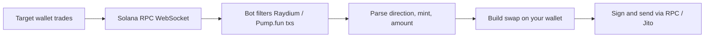

# Solana Copy Trading Bot

A high-performance **Solana copy-trading bot** written in **Rust**. It watches a target wallet’s on-chain activity and mirrors trades on **Raydium** and **Pump.fun** as soon as matching transactions appear.

The bot uses **WebSocket transaction streaming** (Helius-style `transactionSubscribe`) for low-latency detection and can submit copies via **Jito bundles** for faster inclusion.

---

## Table of contents

- [How it works](#how-it-works)
- [Features](#features)
- [Example](#example)
- [Requirements](#requirements)
- [Quick start](#quick-start)
- [Configuration](#configuration)
- [Project structure](#project-structure)
- [How trades are detected](#how-trades-are-detected)
- [Supported venues](#supported-venues)
- [Logging](#logging)
- [Security](#security)
- [Risks and disclaimer](#risks-and-disclaimer)
- [Troubleshooting](#troubleshooting)
- [Contact](#contact)

---

## How it works



1. **Subscribe** — Connect to an RPC WebSocket endpoint that supports `transactionSubscribe` (e.g. [Helius](https://helius.dev)).
2. **Filter** — Only transactions that touch Raydium AMM or Pump.fun program accounts are considered.
3. **Parse** — Extract trade direction (buy/sell), token mint, size, and pool metadata from the target’s transaction.
4. **Mirror** — Execute a proportional swap from **your** wallet using the same venue (Raydium or Pump.fun).
5. **Submit** — Broadcast the signed transaction; optionally route through **Jito** block-engine bundles for priority landing.

---

## Features

| Feature | Description |
|--------|-------------|
| **Real-time streaming** | WebSocket `transactionSubscribe` with `processed` commitment for early detection |
| **Multi-DEX** | Raydium AMM swaps and Pump.fun buy/sell |
| **Target filtering** | Monitors a configurable `TARGET_PUBKEY` |
| **Noise reduction** | Excludes known aggregator/program accounts (e.g. Jupiter) via `accountExclude` |
| **Jito integration** | Optional bundle submission and tip configuration for competitive landing |
| **Structured modules** | Separate `dex`, `engine`, `core`, and `services` layers for maintainability |

---

## Example

**Target wallet**

`GXAtmWucJEQxuL8PtpP13atoFi78eM6c9Cuw9fK9W4na`

**Copy wallet**

`HqbQwVM2fhdYJXqFhBE68zX6mLqCWqEqdgrtf2ePmjRz`

| Role | Transaction |
|------|-------------|
| Target | [View on Solscan](https://solscan.io/tx/2nNc1DsGxGoYWdweZhKQqnngfEjJqDA4zxnHar2S9bsAYP2csbLRgMpUmy68xuG1RaUGV9xb9k7dGdXcjgcmtJUh) |
| Copied | [View on Solscan](https://solscan.io/tx/n2qrk4Xg3gfBBci6CXGKFqcTC8695sgNyzvacPHVaNkiwjWecwvY5WdNKgtgJhoLJfug6QkXQuaZeB5hVazW6ev) |

---

## Requirements

### Software

- **[Rust](https://rustup.rs/)** 1.70+ (edition 2021)
- **Windows**: [Visual Studio Build Tools](https://visualstudio.microsoft.com/downloads/) with the **Desktop development with C++** workload (provides `link.exe` for native dependencies)
- **Linux / macOS**: standard build tools (`build-essential`, Xcode CLI tools)

### Solana / RPC

- A Solana **HTTP RPC** endpoint (`RPC_ENDPOINT`) with good read performance
- A Solana **WebSocket RPC** endpoint (`RPC_WEBSOCKET_ENDPOINT`) that supports **`transactionSubscribe`** (Helius and similar providers)
- A funded **copy wallet** with enough SOL for swaps, ATA creation, and fees (plus Jito tips if enabled)

### Optional

- **[Jito](https://jito.wtf/)** block-engine URL and tip stream URL for bundle-based submission

---

## Quick start

### 1. Clone the repository

```bash
git clone https://github.com/<your-org>/Copy-trading-bot.git
cd Copy-trading-bot
```

### 2. Configure environment

```bash
cp .env.example .env
```

Edit `.env` with your RPC URLs, target wallet, slippage, and Jito settings. See [Configuration](#configuration) for every variable.

### 3. Add your wallet key

The bot loads the signing keypair from **`key.txt`** in the project root (Base58-encoded secret key, one line, no quotes):

```text
your_base58_private_key_here
```

> **Never commit `key.txt` or `.env`.** Both are ignored by `.gitignore` for `.env`; ensure `key.txt` is also kept local-only.

### 4. Build and run

```bash
cargo build --release
cargo run --release
```

On success you should see a startup log line similar to:

```text
---------------------   Copy-trading-bot start!!!  ------------------
```

---

## Configuration

Copy `.env.example` to `.env` and set the values below.

| Variable | Required | Description |
|----------|----------|-------------|
| `RPC_ENDPOINT` | Yes | HTTP Solana RPC URL (e.g. `https://mainnet.helius-rpc.com/?api-key=...`) |
| `RPC_WEBSOCKET_ENDPOINT` | Yes | WebSocket URL for `transactionSubscribe` |
| `TARGET_PUBKEY` | Yes | Public key of the wallet whose trades you want to copy |
| `JUP_PUBKEY` | Yes | Account to **exclude** from the subscription filter (commonly your Jupiter-related pubkey) |
| `RAY_PUBKEY` | Yes | Raydium-related pubkey used in parsing/filtering |
| `SOL_PUBKEY` | Yes | Wrapped SOL / native mint reference for routing |
| `RAY_AUTHORITY_V4` | Yes | Raydium authority v4 address for swap instruction building |
| `WSOL_USDC` | Yes | Reference pool or mint pair for WSOL/USDC lookups |
| `SLIPPAGE` | Yes | Slippage tolerance in basis points (e.g. `100` = 1%) |
| `JITO_TIP_VALUE` | If using Jito | Tip amount (lamports or configured unit per your setup) |
| `JITO_BLOCK_ENGINE_URL` | If using Jito | Jito block engine base URL |
| `JITO_TIP_STREAM_URL` | If using Jito | Jito tip stream URL for dynamic tip hints |
| `JITO_TIP_PERCENTILE` | Optional | Tip percentile when using tip stream (see `services/jito.rs`) |
| `UNIT_PRICE` | Optional | Priority fee unit price (default `1`) |
| `UNIT_LIMIT` | Optional | Compute unit limit (default `300000`) |

### Wallet vs `.env`

- **Signing key**: `key.txt` (Base58), read by `import_wallet()` / `import_arc_wallet()` in `src/common/utils.rs`
- **`.env`**: RPC endpoints, target wallet, DEX constants, slippage, and Jito — not the private key in the current codebase

### Recommended RPC provider

For `transactionSubscribe` with rich transaction details, a provider such as **Helius** is typical. Use the HTTP URL for `RPC_ENDPOINT` and the Geyser/WebSocket URL for `RPC_WEBSOCKET_ENDPOINT`.

---

## Project structure

```text
Copy-trading-bot/
├── Cargo.toml              # Dependencies (Solana SDK, Raydium, Jito, tokio, etc.)
├── .env.example            # Environment template
├── key.txt                 # Your wallet secret (create locally, do not commit)
├── src/
│   ├── main.rs             # WebSocket subscription loop and trade handlers
│   ├── lib.rs              # Module exports
│   ├── common/
│   │   └── utils.rs        # RPC clients, wallet, logging, AppState
│   ├── core/
│   │   ├── token.rs        # SPL token / ATA helpers
│   │   └── tx.rs           # Sign, send, Jito bundle confirmation
│   ├── dex/
│   │   ├── pump.rs         # Pump.fun program constants and swap logic
│   │   └── raydium.rs      # Raydium AMM swap and pool discovery
│   ├── engine/
│   │   └── swap.rs         # High-level pump_swap / raydium_swap entry points
│   └── services/
│       └── jito.rs         # Jito tip accounts, bundle status, progress UI
└── README.md
```

---

## How trades are detected

The bot subscribes with a JSON-RPC payload similar to:

- **Method**: `transactionSubscribe`
- **Filter**: `accountInclude` — Raydium AMM program `675kPX9MHTjS2zt1qfr1NYHuzeLXfQM9H24wFSUt1Mp8` and Pump.fun program `6EF8rrecthR5Dkzon8Nwu78hRvfCKubJ14M5uBEwF6P`
- **Exclude**: `accountExclude` — value from `JUP_PUBKEY` to reduce unrelated aggregator traffic
- **Commitment**: `processed`
- **Encoding**: `jsonParsed` with full transaction details

Incoming messages are routed to:

- **`tx_ray`** — Raydium swap detection and `swap_to_events_on_raydium`
- **`tx_pump`** — Pump.fun buy/sell detection and `swap_to_events_on_pump`

Trade size can be scaled (e.g. `amount_in * percent / 100`) before calling the engine layer.

---

## Supported venues

### Pump.fun

- Program: `6EF8rrecthR5Dkzon8Nwu78hRvfCKubJ14M5uBEwF6P`
- Buy/sell via bonding-curve accounts and associated PDAs
- Implementation: `src/dex/pump.rs`, orchestrated by `engine::swap::pump_swap`

### Raydium

- AMM program: `675kPX9MHTjS2zt1qfr1NYHuzeLXfQM9H24wFSUt1Mp8`
- Pool discovery via on-chain filters and [Raydium API v3](https://api-v3.raydium.io/) (`get_pool_info`)
- Implementation: `src/dex/raydium.rs`, orchestrated by `engine::swap::raydium_swap`

### Jupiter (planned / stub)

`swap_on_jup` in `main.rs` is reserved for Jupiter-based routing when needed.

---

## Logging

Runtime messages are appended to **`src/log.txt`** with timestamps via `log_message()` in `src/common/utils.rs`.

---

## Security

- **Private keys** — Store only on the machine that runs the bot. Prefer a dedicated hot wallet with limited funds.
- **`.env` and `key.txt`** — Must not be pushed to GitHub or shared in chat.
- **RPC API keys** — Treat URLs with embedded keys as secrets; rotate if leaked.
- **Target wallet** — Copying a wallet you do not control is legal/technical risk; verify the address carefully.

---

## Risks and disclaimer

Copy trading on Solana involves **substantial financial risk**: slippage, failed transactions, MEV, illiquid tokens, and total loss of funds are possible. This software is provided **as-is** with no guarantee of profitability, correctness, or uptime. Use at your own risk. Nothing here is financial advice.

---

## Troubleshooting

| Issue | What to try |
|-------|-------------|
| `link.exe` not found (Windows) | Install Visual Studio Build Tools with C++ workload |
| WebSocket connection fails | Verify `RPC_WEBSOCKET_ENDPOINT` and provider supports `transactionSubscribe` |
| `TARGET_PUBKEY not set` | Ensure `.env` is in the project root and loaded (`dotenv` in `main.rs`) |
| `Not set Private Key` / wallet errors | Create `key.txt` with a valid Base58 secret key |
| Trades not copying | Confirm target actually uses Raydium/Pump.fun; check logs in `src/log.txt` |
| Slow or dropped txs | Enable Jito tips, raise priority fees (`UNIT_PRICE` / `UNIT_LIMIT`), use a faster RPC |

---

## Tech stack

| Layer | Technology |
|-------|------------|
| Language | **Rust** (2021 edition) |
| Async runtime | **Tokio** |
| Solana | `solana-sdk`, `solana-client` 1.16.x |
| DEX | Raydium AMM (`raydium-amm`, `raydium-library`), Pump.fun on-chain program |
| Streaming | **tokio-tungstenite** WebSocket client |
| Bundles | **Jito** JSON-RPC block engine client |
| Config | **dotenv**, environment variables |

---

## Contact

For full bot setups, integrations, or custom development:

**Telegram:** [@RRR](https://t.me/microRustyme)

---

If this project helps you, please star the repository.
